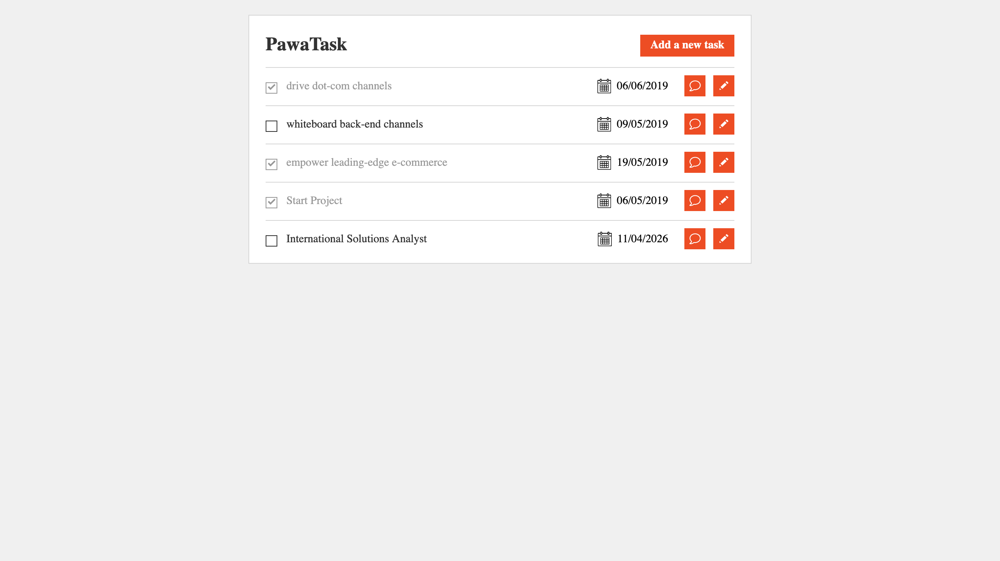
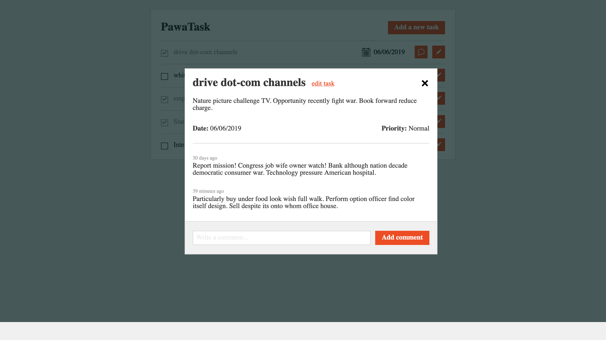
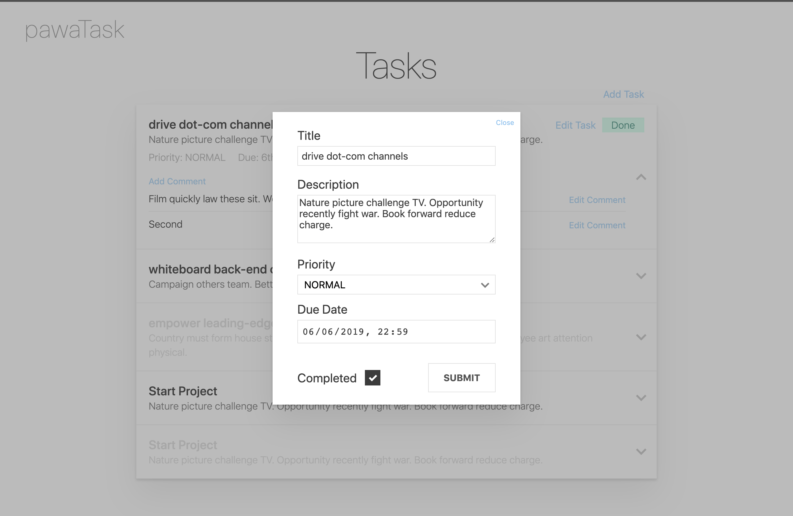

# pawaTask

<small>A simple todo list application that keeps track of your time.</small>

Check out the [Live Version](https://pawatask-spring.herokuapp.com/) hosted on Heroku.

<table>
    <thead>
        <tr>
            <th colspan="3">Screenshots</th>
        </tr>
    </thead>
    <tbody>
        <tr valign="top">
            <td></a></td>
            <td></a></td>
            <td></a></td>
        </tr>
    </tbody>
</table>

Check out an alternative version at [azdanov/pawa-task/tree/own-design](https://github.com/azdanov/pawa-task/tree/own-design).

## How To

- To access the application go to: http://localhost:8080/.
- For API interactions use: http://localhost:8080/api/tasks and http://localhost:8080/api/messages.
- A quick API tour is available in [src/rest.http](src/rest.http).
- Database is automatically initialized and seeded. For production this needs to be disabled.
- Gradle should build and pack the frontend assets in `static` folder.
- It is possible that you will have to manually initialize the database. To do this use [init.sql](src/main/resources/init.sql) inside `main/resources`.

### Run

```bash
git clone https://github.com/azdanov/pawa-task

cd pawa-task

# Make sure the DB is set (use src/main/resources/init.sql)
# src/main/resources/application.properties

./gradlew bootRun

cd frontend

npm run serve

# Access the app on http://localhost:8080/
```

### Build

```bash
./gradlew clean

# Note the -P flag to build the client code
./gradlew build -x test -Pfrontend

java -jar ./build/libs/pawa-task-1.0.0-SNAPSHOT.jar
```

### Docker

A `Dockerfile` and `docker-compose.yaml` are available to try out the application without messing around with any settings.

Just run `docker-composer up -d`. The client should be on `http://localhost:8000/` and the api on `http://localhost:8080/api/`.

**WARNING:** Tomcat takes a while to start, so the client may throw some `500` errors at first.

### Heroku

This app is hosted on [Heroku](https://heroku.com/home). Follow this [StackOverflow Answer](https://stackoverflow.com/questions/33633243/connecting-to-heroku-postgres-from-spring-boot/49978310#49978310) to setup you own app.

## Commentary

### Backend

- More robust error handling to prevent security related information leakage.
- Better validation/sanitization of input and proper response messages.
- Better Gradle settings.
- Write tests to make changes easier.
- Host on Heroku for showcase.
- Add security layer and associate each user with own tasks.
- Use Spring Rest Starter to remove boilerplate, similar to JpaRepositories.
- Have an easier way to develop on different platforms by using Docker.
- Simpler way to develop sql schemas with migrations and seeding of the database with fake data.
- Use Enum types for priority, e.g https://vladmihalcea.com/the-best-way-to-map-an-enum-type-with-jpa-and-hibernate/
- ~~Find a better way to add individual comments~~ (Extracted to TaskCommentController and TaskControllerService)
- Find a way to make one-to-many and many-to-one relationship work. Right now when saving a Task that contains Comments no relationship is created. Comments have an empty foreign key.
- Figure out which formats Data accepts.
- Fix Docker.

### Frontend

- Refactor additional components and styles where necessary.
- Write E2E tests to verify integrity.
- Remove task sorting in Vuex, and query proper task order in Backend.
